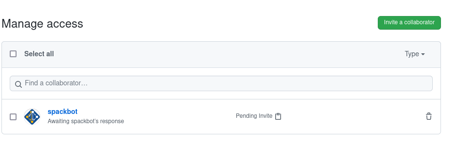

# Developer Steps with Docker Compose

These steps will walk you through setting up a development server with docker-compose
and a "smee" service to emulate a URL.

## 1. Create a webhook receiver

Since we are developing and don't have a proper URL to use (a GitHub App setup
will not accept a localhost address) we need to go to [Smee](https://docs.github.com/en/developers/apps/getting-started-with-apps/setting-up-your-development-environment-to-create-a-github-app#step-1-start-a-new-smee-channel) channel to allow you to register a url that forwards
to localhost. Once you have a url that looks like this:

```bash
https://smee.io/VtrVSOmJV7haXpwH
```

You can proceed to step 2.

## 2. Create secrets

To create your secrets file, copy .env-dummy to .env (which is added to .gitignore)
and then add your smee URL there:

```bash
export SMEE_URL=https://smee.io/VtrVSOmJV7haXpwH
```

The other secrets we will populate after we register the app, discussed next.

## 3. Register a GitHub App

You should next register a [GitHub App](https://github.com/settings/apps) under your username.
You'll first need to create a  [Follow this link](https://github.com/settings/apps) and click "New GitHub App."

#### Create
 - **GitHub App Name**: can be whatever you like, SpackBot Develop for example.
 - **Homepage URL**: you can put the repository here, https://github.com/spack/spackbot
 - You don't need to identify or authorize users.
 - **Webhook URL** enter your smee url
 - **Repo Permissions** You want to add:
   - Administration: read and write
   - Discussions: read and write
   - Issues: read only
   - Pull Requests: read and write
   - checks: read only
   - deployments: read only
 - **Organization Permissions** none
   - Members: read and write
 - **User Permissions** none
 - **Subscribe to events**:
   - issue comment
   - pull requests
   - pull request review comment
   - status
   - check run
   - check suite
   - deployment status
 - It's safer to select to run only on your user account.

#### Post Create
After you create the App you will be redirected to a screen that has the app ID and
secrets. Make a private key, and copy it to the [spackbot](https://github.com/spack/spackbot/tree/main/spackbot) directory
for the app to see, named as `spack-bot-develop.private-key.pem`.

```bash
$ cp $DOWNLOADS/download-key.pem spack-bot-develop.private-key.pem
```

Make sure to add these variables to your .env, specifically adding:

 - GITHUB_PRIVATE_KEY the name of the file in the root here.
 - GITHUB_APP_IDENTIFIER is the "APP ID" at the top
 - GITHUB_APP_REQUESTER is your GitHub account
 - GITHUB_WEBHOOK_SECRET also needs to be added to your app.
 - GITLAB_TOKEN is a Gitlab API token to interact with the GitLab API to re-run pipelines there.
 - SPACKBOT_NAME: can be changed to alter the name of your robot. An `@` is recommended if you want to link pinging your bot with notifying some GitHub account.


#### Credentials

In order for spackbot to be able to push to pull requests (and otherwise have write for different use cases like rebase)
you'll need to provide credentials to the server associated with a GitHub bot account (e.g., [spackbot](https://github.com/spackbot))
and then bind them to the container here for use. If you are unable to do this, you should comment
out the volume in the `docker-compose.yml` (and assume that style fixes, rebases, and similar commands that require
write will not work).

```yaml
volumes:

  # Required for spackbot to have permission to push
  # comment this out if you can't generate
  - ./id_spackbot:/root/.ssh/id_rsa
  - ./id_spackbot.pub:/root/.ssh/id_rsa.pub
```

If you can generate the credential, you can [follow instructions here](https://docs.github.com/en/github/authenticating-to-github/connecting-to-github-with-ssh/generating-a-new-ssh-key-and-adding-it-to-the-ssh-agent). Name it `id_spackbot` when prompted. This will generate `id_spackbot` and `id_spackbot.pub`. You should add `id_spackbot.pub` to your bot's GitHub account.

When you build and start containers, a message should print to confirm or deny that your credentials were found

```bash
Attaching to spack-bot_spackbot_1, spack-bot_smee_1
smee_1      | smee --url https://smee.io/VtrVSOmJV7haXpwH --target http://spackbot --port 8080
smee_1      | Forwarding https://smee.io/VtrVSOmJV7haXpwH to http://spackbot:8080
smee_1      | Connected https://smee.io/VtrVSOmJV7haXpwH
spackbot_1  | Found id_spackbot to authenticate write...
spackbot_1  | Agent pid 8
spackbot_1  | Identity added: /root/.ssh/id_spackbot (xxxxx@xxxxxx)
```

Finally, don't forget to invite your robot as a contributor to your repository with at least
write permission.



**Important**  when you are testing, it must be the case that there is a checkbox
for "maintainer can edit" on the opened PR. If you don't see this box or don't check it,
spackbot will not be able to write to the repository. You can read more about this
[here](https://docs.github.com/en/github/collaborating-with-pull-requests/working-with-forks/allowing-changes-to-a-pull-request-branch-created-from-a-fork).

Keep reading for instructions to build and start containers.


## 4. Build and Start containers

You can then ask docker-compose to build:

```bash
$ docker-compose build
```

And start your containers!

```bash
$ docker-compose up -d
$ docker-compose restart
```

We do the restart to make sure the server and smee are running.
You should be able to see logs (and any errors) by way of:

```bash
$ docker-compose logs
smee_1      | smee --url https://smee.io/VtrVSOmJV7haXpwH --target http://spackbot --port 8080
smee_1      | Forwarding https://smee.io/VtrVSOmJV7haXpwH to http://spackbot
smee_1      | Connected https://smee.io/VtrVSOmJV7haXpwH
spackbot_1  | ======== Running on http://0.0.0.0:8080 ========
spackbot_1  | (Press CTRL+C to quit)
```

Now you can develop/make changes, and then restart the containers to restart the
server. Since [spackbot](https://github.com/spack/spackbot/tree/main/spackbot) is bound to the app install location in the container,
your app will update with changes.

Next you would want to [install the app](install) so you can interact with a pull request
and see the result on your local server.

## 5. Organization

Different events are represented in [spackbot/routes.py](https://github.com/spack/spackbot/tree/main/spackbot/routes.py).
For example, there is one common entrypoint for spackbot to respond to comments,
or the opening of a pull request, or a check run result. So you should first
see if there is a router that already fits your purpose.

1. If yes, you will want to edit the function to include your new route
2. If not, you can add a new router.

In most complex cases, the routers pass on execution to a handler, and handlers
are in [spackbot/handlers](https://github.com/spack/spackbot/tree/main/spackbot/handlers). For each handler, you can write
whatever functionality you need in the submodule (e.g., `handlers.style`) and
then import the function that is needed by the router in `__init__`. Helpers
or variables shared amongst modules should go into [helpers.py](https://github.com/spack/spackbot/tree/main/spackbot/helpers.py),
and comments should go into [comments.py](https://github.com/spack/spackbot/tree/main/spackbot/comments.py).
