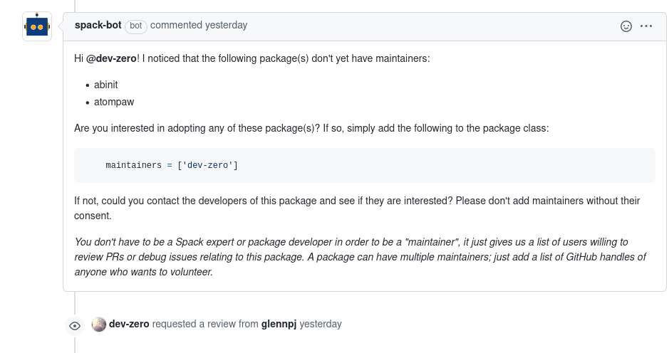
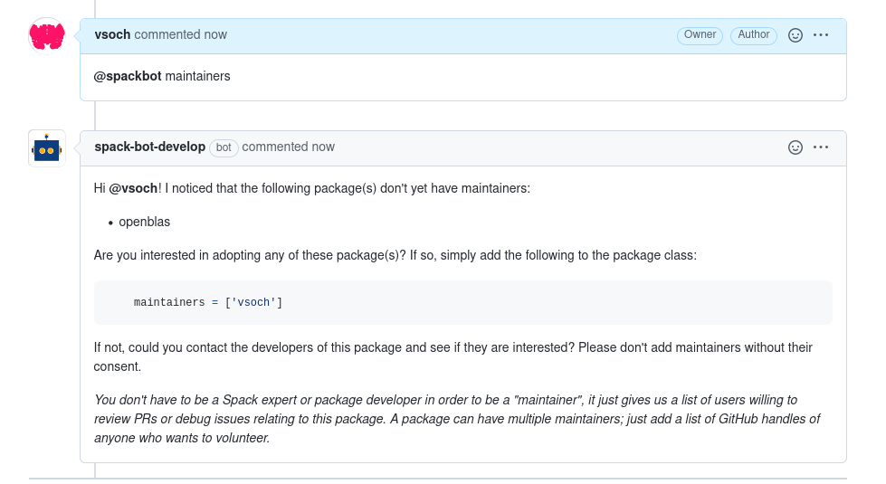
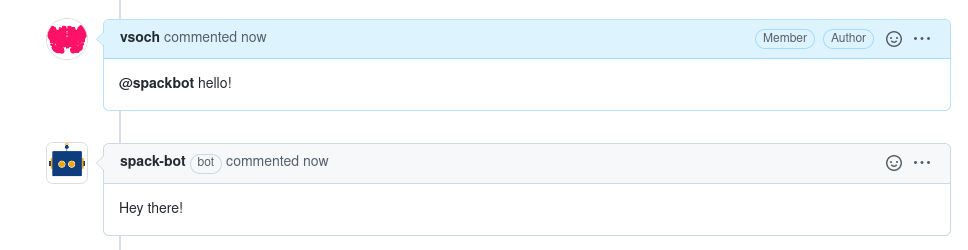
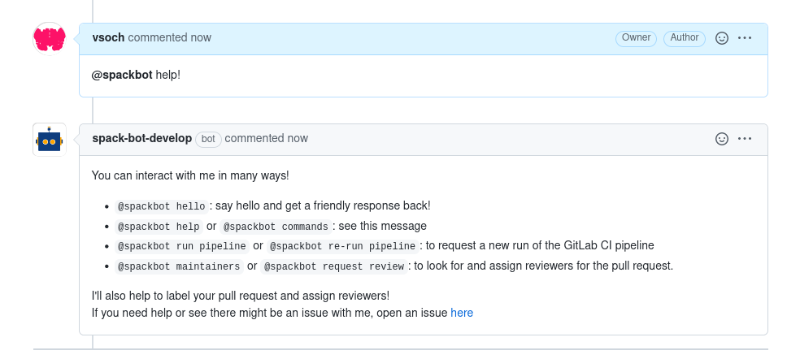
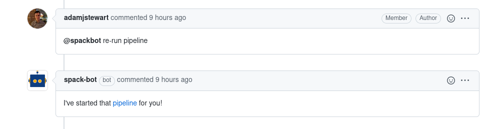
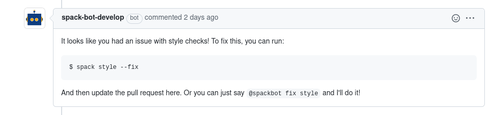

# User's Guide

## Table of Contents

- [How it works](#how-it-works)
- [Interactions](#iteractions)
- [Commands](#commands)
  - [Labels](#labels)
  - [Maintainers](#maintainers)
  - [Hello](#say-hello)
  - [Help](#help)
  - [Pipelines](#pipelines)
  - [Style](#style)

## How it works

Spackbot is a pretty typical GitHub bot. It runs in a container somewhere in the cloud. A
[GitHub App](https://docs.github.com/en/developers/apps/about-apps) is
registered with the Spack project, and the app tells Spackbot about events like
pull requests being opened through
[webhook payloads](https://docs.github.com/en/developers/webhooks-and-events/webhook-events-and-payloads).
The Spackbot process in the container looks at these payloads and reacts to
them by calling commands through the
[GitHub API](https://docs.github.com/en/rest).

## Interactions

The table below shows interactions that spackbot supports. For some, they are 
triggered by user interaction (an `@spackbot` command). Others are run automatically
with different events.

| Name | Description | Command |
|------|-------------|---------|
|labels| Add labels to newly open pull requests | |
|maintainers| Suggest reviewers (package maintainers) for newly opened pull request | |
|hello| Say hello to spackbot | `@spackbot hello`|
|help| Ask for help from spackbot | `@spackbot help` or `@spackbot commands`|
|pipelines| Ask spackbot to re-run a GitLab pipeline | `@spackbot (re-)run pipelines`|
|style| Spackbot will detect a failed style check and tell you how to fix it | |
|fix style| The command to fix style will run `spack style --fix`| `@spackbot fix style`|

## Commands

This is the detailed user guide for interacting with spackbot. Some of these
are commands, verbatim, that you can type into a pull request comment to get a response,
and others are automated interactions that will always happen for pull requests.

## Labels

?> automated interaction

When you open a pull request, spackbot is on the job to help with labels! This
means that he will inspect your changes and add labels that are appropriate.
Here is an example of spackbot seeing a change in fetching logic:


or adding more labels for an extensive change to a package:


## Maintainers

?> automated interaction and chat command

Spackbot is also looking out for packages! When you open a pull request and a package
doesn't have a maintainer, spackbot will make suggestions.



If for some reason you change the pull request or otherwise want to look for maintainers
again, either of the following will work:

```bash
@spackbot maintainers
@spackbot request review
```




## Say Hello

?> chat command

Spackbot is very friendly! Sometimes you just want to say hello, and Spackbot 
is happy to interact with you back!

```bash
@spackbot hello!
```

Here is what the interaction looks like in a pull request comment.




## Help

If you forget how to interact with spackbot, you can hopefully remember how
to ask him for help, which can be done in two ways:

```bash
@spackbot help
@spackbot commands
```


For the commands above (and any command) capitalization does not matter.

## Pipelines

As part of the spack continuous integration, we run a set of pipelines on GitLab alongside
GitHub actions. Sometimes this pipeline can fail to trigger, or we just want it to re-run.
If you have write access to the pull request (meaning you are a maintainer or the submitter)
you can ask Spackbot to re-run pipelines for you:

```bash
@spackbot re-run pipeline
@spackbot run pipeline
```
Either of the above will work, and Spackbot will trigger the pipeline and then
send you a comment that links to it.




## Style

If your pull request fails style checks, Spackbot will tell you how to fix it:



And if you have write access, you can then ask Spackbot to fix it on your behalf!


```bash
@spackbot fix style
```
